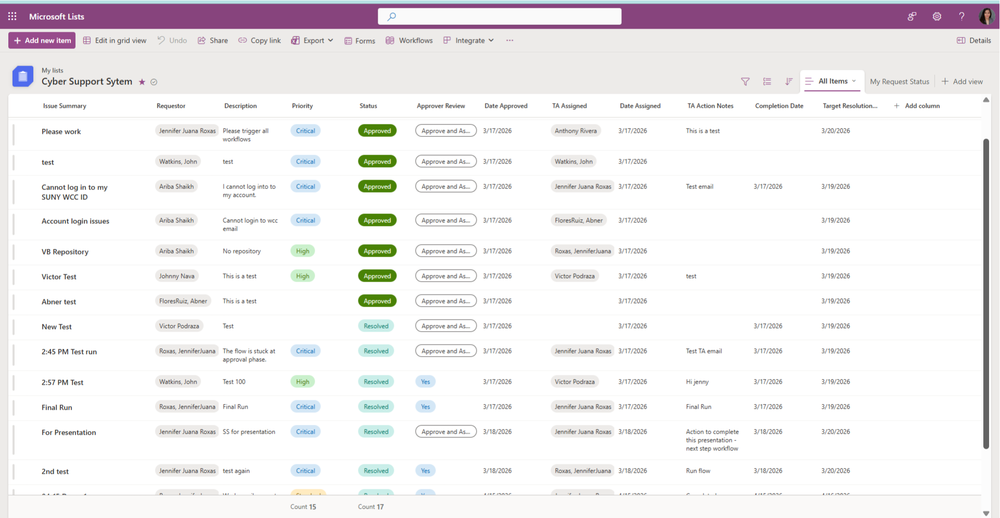

# Automated Incident Ticketing System

An efficient, cloud-native IT ticketing and incident management solution built entirely within the Microsoft 365 ecosystem. This system automates the lifecycle of a support ticket from submission to resolution, reducing manual overhead for technical assistants and administrators.

## 🚀 Key Features

* **Lifecycle Automation:** Seamlessly tracks support requests from creation to closure.
* **Automated Resolution Notifications:** Triggers tailored resolution communications directly to students once a ticket is marked resolved.
* **Centralized Dashboard:** Built on Microsoft Lists for easy filtering, sorting, and status tracking (e.g., New, In Progress, Resolved).
* **M365 Integration:** Seamlessly leverages existing institutional credentials, eliminating the need for external database hosting.

---

## 🛠️ System Architecture & Tech Stack

This solution utilizes a modular, two-flow system to optimize performance and separation of duties:

1. **Cyber Support Request Lifecycle (Flow 1):** Orchestrates core intake tracking, triage transitions, and technician assignments.
2. **Cyber Ticketing - Student Resolution Email (Flow 2):** Dedicated automation handling post-resolution messaging and confirmation steps for student end-users.

### Microsoft List Schema (Data Structure)

To replicate this system, a Microsoft List should be configured with the following columns:

| Column Name | Type | Description |
| :--- | :--- | :--- |
| `Title` | Single line of text | Brief summary of the issue |
| `Requester` | Person or Group | The user experiencing the issue |
| `Category` | Choice | e.g., Hardware, Software, Network, Account Access |
| `Priority` | Choice | Critical, High, Medium, Low |
| `Status` | Choice | New, In Progress, Pending Vendor, Resolved |
| `Assigned To` | Person or Group | The TA or staff member handling the ticket |
| `Resolution Notes` | Multiple lines of text | Final fix documentation |

---

## 📦 Repository Contents

This repository contains the core logic definitions for the automation workflows:
* `CyberSupportRequestLifecycle_2026052018482...` : Main intake and status orchestration workflow package.
* `CyberTicketing-StudentResolutionEmail_20260...` : Resolution communication logic package.

---

## 🚀 Deployment / Installation Guide

1. **Create the List:** Build a Microsoft List using the schema detailed above.
2. **Import Workflows:** Go to [make.powerautomate.com](https://make.powerautomate.com), select **Import Package (Legacy)**, upload both `.zip` files from this repository, link them to your target list connections, and turn them on.
